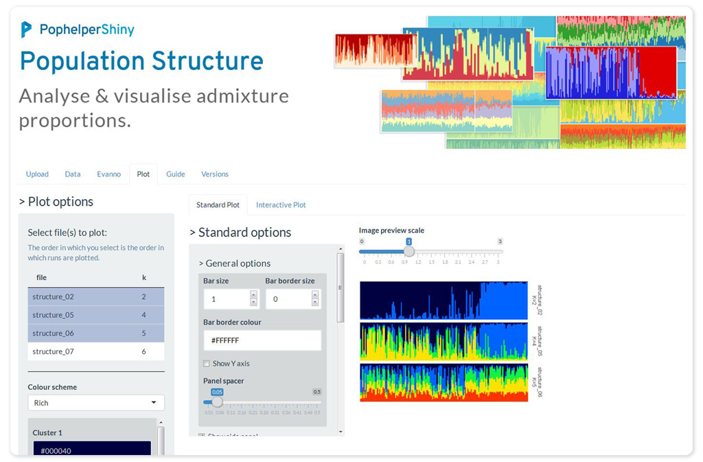

# pophelperShiny  

`pophelperShiny` compliments the R package `pophelper` by providing a graphical user interface around the fuctions. This app is used to analyse and visualise population structure from programs such as STRUCTURE, TESS, TESS3, BAPS and numeric delimited formats such as ADMIXTURE or fastSTRUCTURE. The app can be used to read run files to R, tabulate runs, summarise runs, estimate *K* using the Evanno method, align clusters within K using CLUMPP and generate barplot figures.  



## Features

- Upload STRUCTURE, BAPS, fastSTRUCTURE, STRUCTURE, TESS or any tabular run files.  
- Tabulate and summarise runs by *K*.  
- Evanno method for estimation of optimal *K* for STRUCTURE files. 
- Single or joined barplots from any run file.  
- Adjust cluster colours
- Align and/or merge clusters.  
- Label barplots with group labels. 
- Reorder groups.  
- Sort individuals by label, any cluster or all clusters.  
- Interactive barplot to zoom/pan and identify individuals.  
- Export all data tables and images in various formats.  

## Usage

The app can be used in a few different ways. It can be run locally as a docker container. It can be installed as a regular R package and run locally.  The app can also be accessed online at [pophelper.com](http://www.pophelper.com). This last option will not be maintained for longer.

### Docker

Docker helps you run this tool without having to install R or any R packages. But you need to have the docker tool installed. [Docker](https://www.docker.com/get-started) is free and is available on all OS. 

Run in a linux/unix terminal.

```
docker run --rm -p 8787:8787 royfrancis/pophelpershiny:v2.1.1
```

The app should be available through your web browser at `http://0.0.0.0:8787`.

### Install locally

You need to have the latest [JAVA JDK and JRE](http://www.oracle.com/technetwork/java/javase/downloads/index.html) installed on your system. You need to have R (>= 3.6) statistical package installed. [R](https://www.r-project.org/) is open-source and freely available to download for Windows, Mac and other OS. Then, basically run the code below. This installs the dependency packages, then it installs `pophelperShiny` from `github` using the `remotes` package.  

```coffee
# install dependencies and remotes
install.packages(c("ggplot2","gridExtra","label.switching","tidyr","remotes",
                   "colourpicker","DT","highcharter","htmlwidgets","magrittr",
                   "markdown","RColorBrewer","shiny","shinyAce","shinyBS",
                   "shinythemes","shinyWidgets","viridisLite","writexl"),
                   repos = "http://cran.us.r-project.org")

# install pophelper package from GitHub
remotes::install_github('royfrancis/pophelper')

# install the package from GitHub
remotes::install_github('royfrancis/pophelperShiny')

# load library for use
library(pophelperShiny)

# launch app
runPophelper()
```

## Citation 

> Francis, R. M. (2017). POPHELPER: an R package and web app to analyse and visualize population structure. _Molecular Ecology Resources, 17_(1), 27-32. DOI: 10.1111/1755-0998.12509

## Disclaimer

This R package is offered free and without warranty of any kind, either expressed or implied. I will not be held liable to you for any damage arising out of the use, modification or inability to use this program. This R package can be used, redistributed and/or modified freely for non-commercial purposes subject to the original source being properly cited. Licensed under GPL-3. Please make sure you verify all your results.  

## Contact

If you have an comments, suggestions, corrections or ideas on ways to improve or extend this package, feel free to submit an issue on the [Github issues page](https://github.com/royfrancis/pophelperShiny/issues).  
