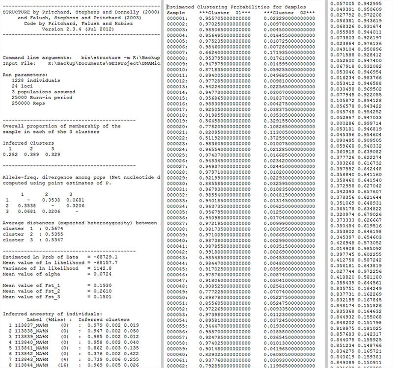
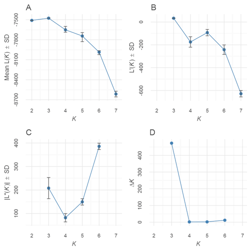
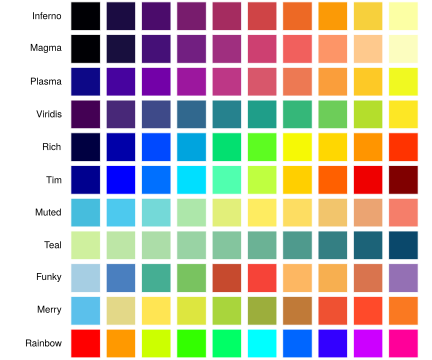
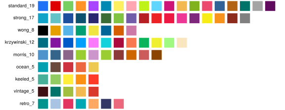
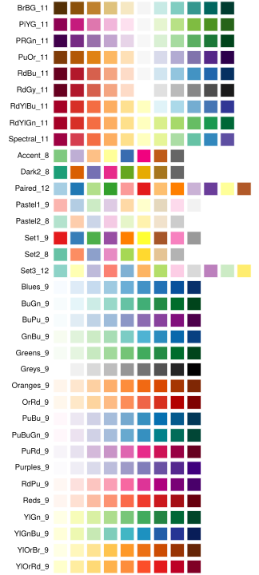
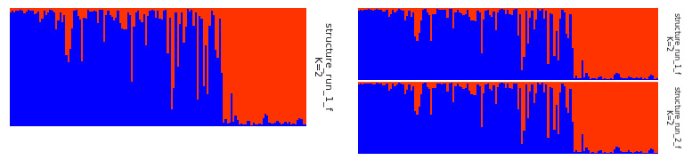
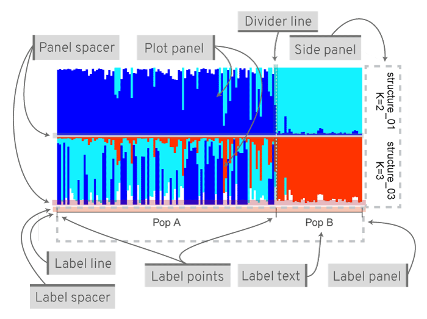
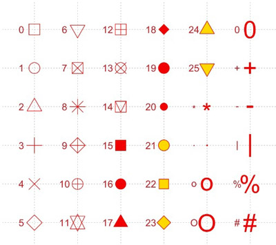

</br>

## 1. General

- Once the app is loaded in the browser, the session is ready for use.  
- It is best to adjust widgets in the order from top left to bottom right. This is because once changes have been made to widgets further down, changes to top widgets may reset the settings of those below. 
- See section **FAQs**.
- When running locally, open app in a system browser rather than the RStudio browser. In the RStudio browser, click on **Open In Browser**. Downloads only work in a system browser.

## 2. Features

- Upload STRUCTURE, BAPS, fastSTRUCTURE, STRUCTURE, TESS or any tabular run files.  
- Tabulate and summarise runs by *K*.  
- Evanno method for estimation of optimal *K* for STRUCTURE files. 
- Single or joined barplots from any run file.  
- Adjust cluster colours
- Align and/or merge clusters.  
- Label barplots with group labels. 
- Reorder groups.  
- Sort individuals by label, any cluster or all clusters.  
- Interactive barplot to zoom/pan and identify individuals.  
- Export all data tables and images in various formats.  

## 3. File upload

Files are uploaded interactively in the *Upload* tab. **Input format** option **Auto** should generally work. The following file types are expected: STRUCTURE, BAPS, TESS, ADMIXTURE output files or fastSTRUCTURE meanQ files. If using files as inputs from other software or modified files, from spreadsheets etc, they must be all numeric tabular data without headers in tab-delimited, space-delimited or comma-separated format. Decimal must be defined by dot. Combined, aligned and merged CLUMPP file from R package `pophelper` is also supported. If you think, a file format is incorrectly identified, you can manually set **Input format**. __Mixed file formats are not supported__.  

On successful completion of upload, a summary table of uploaded files is shown. Fields shown are filename, file format and size of the file. File formats identified are STRUCTURE, BAPS, TESS, CLUMPP or BASIC files. Other text files or files of incorrect format are displayed as UNIDENTIFIED. ADMIXTURE and fastSTRUCTURE files are simple tables without headers differing in delimiter spaces. Any text file that is all numeric in a tabular format with space/tab/comma delimiter will be identified as BASIC format.  

  

<b>Fig. </b>  1: _A preview of the input files. STRUCTURE file (Left), TESS file (centre) and BASIC (ADMIXTURE) file (right). To download sample files, see downloads section._

## 4. Data

The *Data* tab shows tabulated and summarised tables.  

### 4.1 Tabulated data

A tabulated table is displayed for a set of one or more identified run files. Tabulated data lists all runs sorted by loci, individuals and *K* for STRUCTURE runs. The table is sorted by individuals and *K* for other run formats. Tabulated data is not displayed if uploaded files consist of mixed formats. The tabulated data can be download using the download button the left side.  

### 4.2 Summarised data

The summarised table is created from the tabulated table. For STRUCTURE runs, the summarised data table is sorted by **loci**, **ind**, *K* and runs followed by **elpdmean**, **elpdsd**, **elpdmin** and **elpdmax**. For other run formats, the table is sorted by **ind**, *K* and **runs**. Summarised data is not displayed if uploaded files consist of mixed formats. The summarised data can be download using the download button the left side.  
 
## 5. Evanno method

The Evanno method is used to estimate the number of *K*. The method is based on Evanno et al., (2005) and only applicable to STRUCTURE runs. The Evanno method can be performed in the *Evanno* tab.  

The *Input* tab shows a tabulated list of STRUCTURE files on the left side. By default, all runs are selected. A subset of runs can be used for the Evanno analysis by selecting (by clicking) the rows/runs in the input table. A K-Plot (Mean of Estimated Log-likelihood  over *K*) for the selected run is shown on the right side.  

The *Output* tab shows a table of the Evanno results showing various derivatives as well as a scatterplots based on the same table. The data is available to download as a text file.  

The Evanno method is computed only if the selected runs fulfill the following criteria:  

* At least 3 different values of *K*  
* At least 2 repeats for each value of *K*
* Number of loci must be same across all *K*  
* Number of individuals must be same across all *K*  
* Sequentially increasing values of *K*. For example, *K* values cannot be 2,3 and then 5.  

This is the minimum requirement. Evanno method benefits from having several repeats for each *K* across a wide range of *K*. The Evanno results table and plot can be downloaded using the download options on the left of the page. 

  

<b>Fig. </b>  2: _An Evanno method output plot._

## 6. Plotting

Two types of plots are available: **Standard Plot** and **Interactive Plot**. For finer control and print, the **Standard Plot** may be better. For quick assessment of results using mouse hover tool tips and zoom control, use **Interactive Plot**.

### 6.1 Plot options

The **Plot options** are common for Standard and Interactive plots.  

A list of uploaded files are displayed. The default selection type is **Datatable**. With this, the selection order is maintained. In case the **Datatable** option does not work, the **Picker** option is available. In this case, the selection order is not maintained.

Runs to be plotted needs to be selected. The run is plotted as a barplot on the right side. If more than one run is selected, then runs are plotted one below the other as joined plots. Multiple plots are plotted as joined plots for standard plot and plotted separately for interactive plots.  

#### 6.1.1 Colour palette

A selection of colour palettes are available to colour the clusters on barplots. The default is the **Rich** colour palette. Selecting any colour palette generates input widgets with colours equal to the max number of clusters in the selected runs. The colours are selected based on the palette, but can be changed if required. Manually input colours must be in hexadecimal format or picked using the colour picker. Input must look like this: `#2121D9`. Transparency is not supported. The number of colours available in each palette is shown in parenthesis `()`. If a number is not displayed, then there are no limits to the number of colours. Colour palettes are grouped into Function-based colours (FB) and Pre-defined colours (PD). PD and FB have slightly different properties. 

##### 6.1.1.1 Function-based colours

FB colours are generated from a function. FB colours are not limited in numbers and can take any *K* value. New colours are added to the middle of the sequence as *K* increases. For example, **Rich** palette produces Blue and Red for *K*=2 and Blue, LightBlue and Red when *K*=3 and Blue, LightBlue, Yellow and Red when *K*=4 etc. Function-based colour schemes are shown below.  



<b>Fig. </b>  3: _Function-based colour schemes showing scheme name. There is no limit on the number of colours when using these schemes._

##### 6.1.1.2 Pre-defined colours

PD colours have pre-defined values as well as a pre-defined length of colours. PD colours are always selected in the same sequence of colours. For example, **Standard** palette produces Blue and Red when *K*=2 and Blue, Red and Green when *K*=3 etc. New colours are added to the end of sequence as *K* increases. Pre-defined colour schemes are shown below.  



<b>Fig. </b>  4: _Pre-defined colour schemes showing scheme name and length of colours._

An extra category of **Pre Defined** colours called **Pre Defined ColorBrewer** is available. This option makes available colour palettes from [Colorbrewer](http://colorbrewer2.org/). Note that Colourbrewer palettes have a limit on the number of colours.  



<b>Fig. </b>  5: _Pre-defined colour schemes from Colorbrewer showing palette name and length of colours._

#### 6.1.2 Align clusters/Merge runs

When two or more runs are selected, a dropdown menu is available to align clusters or merge runs. Align clusters/Merge runs only works if the selected runs are of same run format and same number of individuals. For structure runs, the number of loci must be same too. 
**Align within K** align clusters between replicate runs of each K. **Align across K** first aligns clusters within K and then across K. The runs are reordered after alignment, but the number of runs and the order of individuals remain the same. **Merge runs** aligns runs across K and then merges replicate runs within each K. The number of runs will be lower after merging. If all runs belong to the same K, aligning across K is disabled and merging returns one run.   

#### 6.1.3 Order individuals

Order/Sort individuals by individual labels, one of the clusters or all clusters. Based on the selected run/runs, the sortable clusters are shown in the dropdown menu. For eg: if runs *K*=3 and *K*=4 are selected, sortable clusters would be Cluster1, Cluster2 and Cluster3, since Cluster4 is not present in one of the files. If one of the clusters is selected (Eg. Cluster1), all selected runs are sorted by the selected cluster. If **All** is selected, then run(s) are sorted using all the clusters using a method similar to **Sort by Q** option in the STRUCTURE software. If group labels (section 6.1.5) are in use, individuals are sorted within the groups.  

#### 6.1.4 Individual labels

Individuals are labelled numerically by default. By checking **Use individual labels**, individual labels can be read in from input STRUCTURE files, pasting into the input field or by uploading an individual labels file. Selecting **Upload file** allows to upload a single column text file with individual labels. This file must be tab-delimited or comma-separated. It must have no headers. Selecting **Paste text** allows for the labels to be pasted or manually typed in. It is possible to copy-paste from a spreadsheet (Excel) or text editor. The number of labels must be equal to the number of individuals in the run file. These individual labels are used when sorting individuals by labels (section 6.1.3). By checking **Show individual labels**, these labels are displayed under the plot (for standard and interactive plot). Checking **Use individual labels** also displays the **Individual label options** panel. More details about this panel is described under Individual label options (section 6.2.2).

When group labels (section 6.1.5) are used alongside individual labels, a checkbox option **Concatenate ind & group labels** becomes active. Checking this concatenates all group labels with individual labels to create a long individual label per sample. The separator between the concatenated labels can be specified.

#### 6.1.5 Group labels

Population labels can be displayed under the plots (for standard plots) and in the hover tooltips (for interactive plot). Selecting the **Upload file**, group labels can be uploaded as a text file (tab-delimited or a comma-separated) with one or more columns. The file MUST have a header. Each column is referred to as a group label set. The headers are referred to as group label titles. And the actual labels are referred to as group label text. The number of rows must be equal to the number of individuals in the run file. Download a sample file in Downloads (section 7).

Selecting **Paste text** allows for the labels to be pasted or manually typed in. In this case only one label set (one column) is allowed. One label per line. There should be no header. Just to be clear, if this one column group label is uploaded as a file, it must have a header.
   
#### 6.1.6 Active group label title

All available group label titles are listed in the dropdown menu. The first group label title is automatically selected as the active set. This can be changed by selecting another group label title from the dropdown menu. The active group label set is used for grouping when sorting individuals (section 6.1.3), subsetting (section 6.1.7), ordering groups (section 6.1.8) and when computing mean (section 6.1.9) over groups.

#### 6.1.7 Subset/Order group

Based on the active group label set (section 6.1.6), group labels from that set are available to subset or reorder. The default is **None** which means do not subset or reorder. **None** must be deleted for this widget to be active.  

Groups can be subsetted by selecting one or more groups. Delete a selected pop using the <kbd>Backspace</kbd> key. Use the <kbd>Left</kbd> <kbd>Right</kbd> arrow keys to jump to labels. Position of groups can be changed by changing their order in the widget. For eg. An initial order of *Grp A, Grp B* can be changed to *Grp B, Grp A*.

#### 6.1.8 Order group labels

When group labels are not in contiguous blocks or they are ordered non-alphabetically, they can be reordered by checking the option **Order group labels**. All group label sets are ordered alphabetically starting with the active group label set (section 6.1.3).

#### 6.1.9 Compute mean over groups

Mean across all individuals within the currently active group (section 6.1.3) is computed and displayed.

### 6.2 Standard Plot

  

<b>Fig. </b>  6: _Sample of a single plot on left and a sample of joined plot on the right._

#### 6.2.1 Standard options

These are basic options that apply to the standard plot. The standard options are organised into the following sections: general options, side panel options, title options, subtitle options and legend options. Each section has a **Reset panel** button which resets all settings in that section to default settings.

The **Bar size** controls the width of the bars. The **Bar border size** controls the border size on bars. **Bar border colour** sets the border colour on the bars. The colour is only visible when the border size >0. **Show Y axis** when checked displays the Y-axis. This also displays additional widgets to control size and length of ticks. When two or more runs are selected, the **Panel spacer** option is used to adjust spacing between run panels on the plot. 

**Show side panel** when checked displays a side panel on the right side of standard displaying the filename and *K* value. The default labels can be changed by providing comma separated labels. Other side panel options control side panel position, text size, text colour and background colour. Click on the **Reset panel** button to reset all the settings in the side panel options.

Checking **Show plot title** displays a title on top of the plot. The label can be changed as well as the title text size, title spacer (the space between the title and the region below), horizontal and vertical justification and the title colour.

Checking **Show plot subtitle** displays a subtitle on top of the plot. The label can be changed as well as the subtitle text size, subtitle spacer (the space between the subtitle and the region below), horizontal and vertical justification and the subtitle colour.

Checking **Show cluster legend** displays a legend showing cluster colours. The legend labels default to cluster names, but this can be changed by providing a comma separated label list. The legend text size, key size and spacing can be adjusted.

#### 6.2.2 Individual label options

Checking **Use individual labels** (section 6.1.4) displays the **Individual label options** panel. The **Common individual labels** option when checked displays individual labels only under the lowermost plot (for standard plot and in case multiple plots are displayed). Unchecking this option displays individual labels under each plot panel. When sorting individuals by cluster (section 6.1.3), **Common individual labels** option must be unchecked.

The individual labels panel height can be adjusted along with the spacer (space between the individual labels and the region above). The label size, colour, horizontal and vertical justification and angle can be adjusted.

#### 6.2.3 Group label options

Checking **Use group labels** (section 6.1.5) displays the **Group label options** panel. This panel is organised into the following sections: general options, text options, point options, line options and divider options.

  

<b>Fig. </b>  7: _A typical joined plot with group labels. Various parts of the figure and options to customise._

The group labels panel height can be adjusted along with the spacer (space between the group labels and the region above). The panel ratio takes two numbers separated by a comma denoting ratio of plot area to group-label area like `3,1`. The **Label marker colour** is the colour applied to all label marker elements such as lines and points. 

The text options control the text y-position, text colour, size, angle and horizontal justification. Label points separate the groups. The point size (ex. 1) and point type can be adjusted. The default point type is `|`. This can be changed to any character. If a number is provided, then a standard R plotting symbol (pch) is used instead. Point options control point size and point type. 

  

<b>Fig. </b>  8: _Number for plotting characters._

The horizontal line seen with the labels is the label line. Line options control line y-position, line thickness and line type. The line type can be a single digit or double digit number. A single digit denotes one of the line types in the figure below. A double digit denotes the length of mark and length of the space. For example, 22 means a line with a mark of distance 2 followed by a space of distance 2.  

  

<b>Fig. </b>  9: _A few of the line types._

Divider options control the vertical lines separating groups. The divider lines are drawn between groups of the active group label set (section 6.1.6). This can be changed to one or more group label sets by selecting the group label title. Use arrow keys to move cursor left/right. Use backspace to remove a label. Other options allow to control the thickness of the div line and the line type.

#### 6.2.4 Image preview scale

The image preview scale slider allows to adjust the display size of the preview plot in the browser. The scale does not affect the download options.  

#### 6.2.5 Download options

Empty fields for height and width will generate default values (recommended). __Note__: The height is height of one run panel and not the height of the entire figure. If 2 runs are selected, a height of 2 cm means each run will be 2 cm and the final figure will be around 4 cm high. The default image resolution is 200dpi. When specifying height and width, note that it is in cm. Changing the file type does not change the preview but it changes the downloaded file type.  

### 6.3 Interactive Plot  

The interactive plot makes it easier to explore the data. It allows zoom control, drag/slide and hover tool tips to identify samples. Note that interactive plots are computationally more intensive to display and change especially for datasets with large number of individuals.

#### 6.3.1 Interactive plot usage

Hovering the cursor over the plot shows the current position (Cur Pos), original position (Orig Pos), individual ID, cluster (*K*) and the y-axis value (assignment probability) in the tool tip. If group labels (section 6.1.5) are in use, group label from each group label set is also displayed for that individual. The original position may be useful when sorting the individuals. The original position does not work with **Align/Merge runs (within K)** option. When individual labels (section 6.1.4) are in use, individual labels is shown as individual ID.

Click and drag on the plot (horizontally) to zoom in. Click **Reset** to reset zoom. When zoomed in, press <kbd>Shift</kbd> and drag (horizontally) to slide the view. Clusters can be turned on or off by clicking on the legend icons (top right). When multiple runs are selected, plots are created one below the other in the order in which the files are selected. Click on the top left corner and choose an option to download the plot.

#### 6.3.2 Interactive options

The height and width of plots can be adjusted. The size of the bar border and the spacing between bars can be adjusted. The legend can be turned on or off. The filename can be shown on the bottom right or on top left.  

## 7. Downloads

* Download STRUCTURE 2.3.4 run files, group labels and individual labels [here](https://www.dropbox.com/s/wt28ksmjucb7pjv/structure.zip?dl=1).  
* Download TESS 2.3 run files and group labels [here](https://www.dropbox.com/s/4aexcv75p1f10u9/tess.zip?dl=1).  
* Download a BAPS run file [here](https://www.dropbox.com/s/aprqximvj8b0f8e/baps.zip?dl=1).
* Download ADMIXTURE run files and group labels [here](https://www.dropbox.com/s/q13y3qchd8jopeb/admixture.zip?dl=1).  
* Download fastSTRUCTURE run files and group labels [here](https://www.dropbox.com/s/woe2nvul3c2whjn/faststructure.zip?dl=1).  
* Download combined, aligned and merged CLUMPP files [here](https://www.dropbox.com/s/nb3t1zv2rbq49x8/clumpp.zip?dl=1).  

## 8. FAQs

+ __Nothing visible in Evanno tab:__ Evanno option is available only for structure runs. Likely issue is that uploaded files are not STRUCTURE runs or consists of mixed formats.  

+ __When uploading lots of files to the web app, the upload bar tends to be frozen:__ The bar sometimes appear frozen, but the upload is in progress. The summary table should be visible after a few minutes. Better to zip all the files into one file and upload. This issue is only applicable to the online version of the app.  

+ __A popup error with 'The application unexpectedly exited.':__ This error is reported when the app has crashed. This can happen due to a whole range of unexpected issues. The solution is to refresh the browser and continue as normal. Else, close tab and open webpage in new tab. If this happens consistently, please report to me with explanation on what you were doing when it happened. This issue is only applicable to the online version of the app.  

+ __After working with some files, reuploading new files in the same session often produces a pop-up error like 'The application unexpectedly exited':__ The solution is to refresh the browser or reload the page. This issue is only applicable to the online version of the app.  

+ Under standard plot options, the sub sections can be collapsed by clicking on the section title. For example **> Standard options**, **> General options** etc. This might be useful to quickly reduce clutter. But note that variables in the hidden widgets are not accessible to the plotting function and can lead to strange errors.

+ __Downloads do not work:__ When running locally, open app in a system browser rather than the RStudio browser. In the RStudio browser, click on **Open In Browser**. Downloads only work in a system browser.

+ To exit the running app locally, press the <kbd>Esc</kbd> key in the R console.

+ If you want to validate the results (Evanno plot, CLUMPP results) produced here, or if this service does not work, check out [StructureHarvester](http://taylor0.biology.ucla.edu/structureHarvester/).  

## 9. Citation 

> Francis, R. M. (2017). POPHELPER: an R package and web app to analyse and visualize population structure. _Molecular Ecology Resources, 17_(1), 27-32. DOI: 10.1111/1755-0998.12509

## 10 Contact

If you have any comments, suggestions or would like to report an issue, please create an issue on the PophelperShiny [GitHub](https://github.com/royfrancis/pophelperShiny) page.  

## 12 Session


```
## R version 3.6.0 (2019-04-26)
## Platform: x86_64-pc-linux-gnu (64-bit)
## Running under: Ubuntu 18.04.3 LTS
## 
## Matrix products: default
## BLAS:   /usr/lib/x86_64-linux-gnu/openblas/libblas.so.3
## LAPACK: /usr/lib/x86_64-linux-gnu/libopenblasp-r0.2.20.so
## 
## locale:
##  [1] LC_CTYPE=en_GB.UTF-8          LC_NUMERIC=C                 
##  [3] LC_TIME=en_GB.UTF-8           LC_COLLATE=en_GB.UTF-8       
##  [5] LC_MONETARY=en_GB.UTF-8       LC_MESSAGES=en_GB.UTF-8      
##  [7] LC_PAPER=en_GB.UTF-8          LC_NAME=en_GB.UTF-8          
##  [9] LC_ADDRESS=en_GB.UTF-8        LC_TELEPHONE=en_GB.UTF-8     
## [11] LC_MEASUREMENT=en_GB.UTF-8    LC_IDENTIFICATION=en_GB.UTF-8
## 
## attached base packages:
## [1] stats     graphics  grDevices utils     datasets  methods   base     
## 
## other attached packages:
##  [1] stringr_1.4.0        captioner_2.2.3      bookdown_0.12       
##  [4] knitr_1.24           pophelperShiny_2.0.2 shinyWidgets_0.4.8  
##  [7] writexl_1.1          shinythemes_1.1.2    Cairo_1.5-10        
## [10] xlsx_0.6.1           rJava_0.9-11         dplyr_0.8.3         
## [13] highcharter_0.7.0    shinyBS_0.61         viridisLite_0.3.0   
## [16] colourpicker_1.0     shinyAce_0.4.0       DT_0.8              
## [19] RColorBrewer_1.1-2   gtable_0.3.0         gridExtra_2.3       
## [22] tidyr_0.8.3          markdown_1.1         shiny_1.3.2         
## [25] pophelper_2.3.0      ggplot2_3.2.1       
## 
## loaded via a namespace (and not attached):
##  [1] pkgload_1.0.2       jsonlite_1.6        label.switching_1.8
##  [4] assertthat_0.2.1    TTR_0.23-4          highr_0.8          
##  [7] xlsxjars_0.6.1      yaml_2.2.0          pillar_1.4.2       
## [10] backports_1.1.4     lattice_0.20-38     glue_1.3.1         
## [13] rlist_0.4.6.1       digest_0.6.20       promises_1.0.1     
## [16] colorspace_1.4-1    htmltools_0.3.6     httpuv_1.5.1       
## [19] lpSolve_5.6.13.2    pkgconfig_2.0.2     broom_0.5.2        
## [22] purrr_0.3.2         xtable_1.8-4        scales_1.0.0       
## [25] whisker_0.3-2       later_0.8.0         tibble_2.1.3       
## [28] combinat_0.0-8      generics_0.0.2      withr_2.1.2        
## [31] lazyeval_0.2.2      quantmod_0.4-15     magrittr_1.5       
## [34] crayon_1.3.4        mime_0.7            evaluate_0.14      
## [37] nlme_3.1-139        xts_0.11-2          tools_3.6.0        
## [40] data.table_1.12.2   munsell_0.5.0       packrat_0.5.0      
## [43] compiler_3.6.0      rlang_0.4.0         grid_3.6.0         
## [46] rstudioapi_0.10     htmlwidgets_1.3     igraph_1.2.4.1     
## [49] miniUI_0.1.1.1      testthat_2.2.1      curl_4.0           
## [52] R6_2.4.0            zoo_1.8-6           lubridate_1.7.4    
## [55] rprojroot_1.3-2     desc_1.2.0          stringi_1.4.3      
## [58] Rcpp_1.0.2          tidyselect_0.2.5    xfun_0.8
```

__End of Document__


